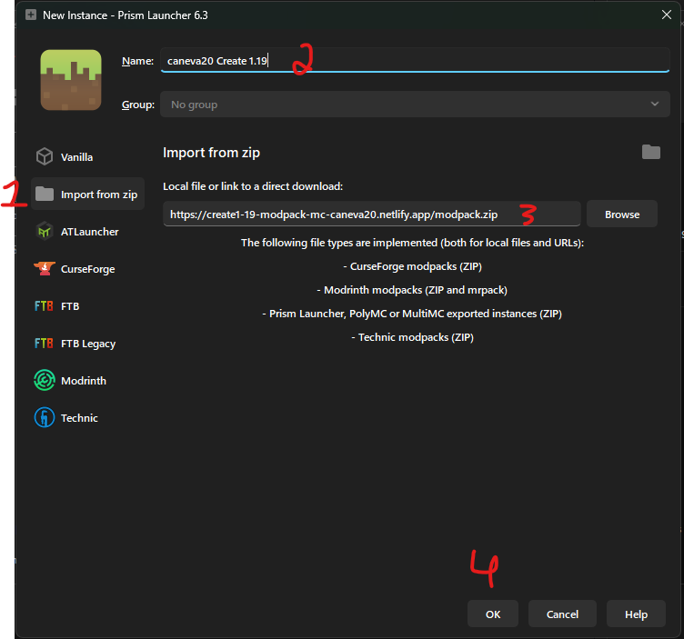
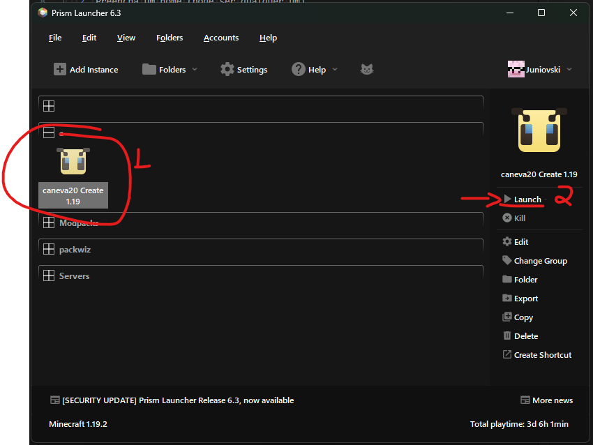

# Servidor 1.19 - Forge

## Informações de conectividade

> Ip: `forge-119.mc.caneva20.me`

## Como adicionar a modpack

1. Baixe o [Prism Launcher](https://prismlauncher.org/download/)
   1. Se você não tiver uma conta original, baixe-o por aqui: [Prism Launcher - Cracked](https://github.com/Diegiwg/PrismLauncher-Cracked#downloads-mediafire)
2. Crie uma nova instancia 
3. Adicione a configuração a seguir: 
   1. Click em **Import from Zip**
   2. Preencha um nome (pode ser qualquer um)
   3. Cole esse link:

        ```shell
        https://joyful-salmiakki-7d75af.netlify.app/caneva20%201.19%20-%20Forge.zip
        ```

   4. Click em **OK**
4. Abra o modpack 😊 